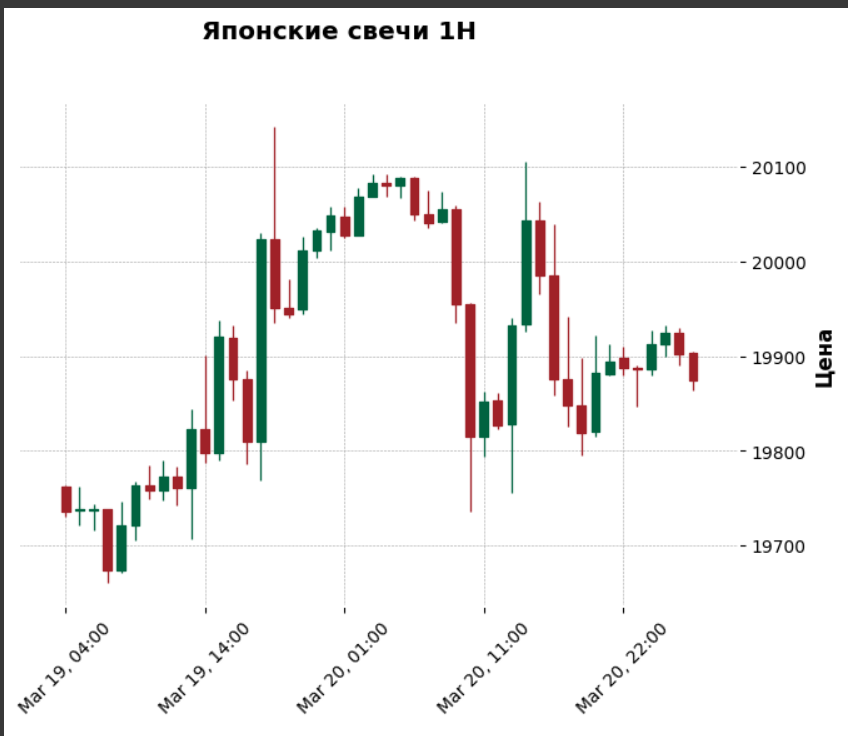
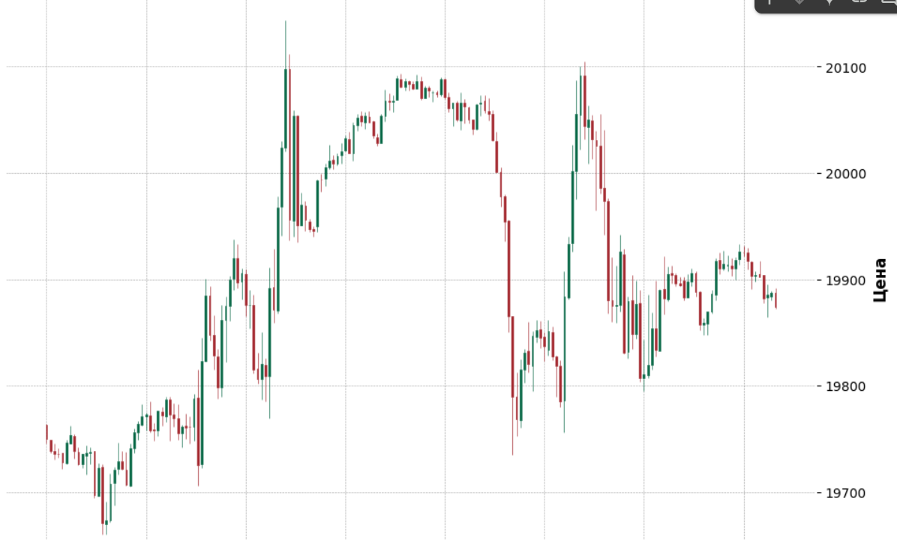

# Candels
Finding order blocks and imbalances

Entry datas:
The data is presented as a minute-level time series of trades with the following fields:

task_orders.xlsx

datetime - date/time

open - opening price

close - closing price

high - highest price within the time interval

low - lowest price within the time interval

volume - sales volume

Problem statement:

1.Identify order blocks within the hourly timeframe and determine their trend.

2.Identify imbalances within the hourly timeframe.

3.Based on the identified (or not identified) hourly imbalances, determine the price range of the order blocks.

4.Identify imbalances within the 15-minute timeframe and their trend.

5.Determine the price range of 15-minute imbalances within the hourly order blocks.

6.Prepare the final table.
# Plots

# Resault

(foto_res.png)
